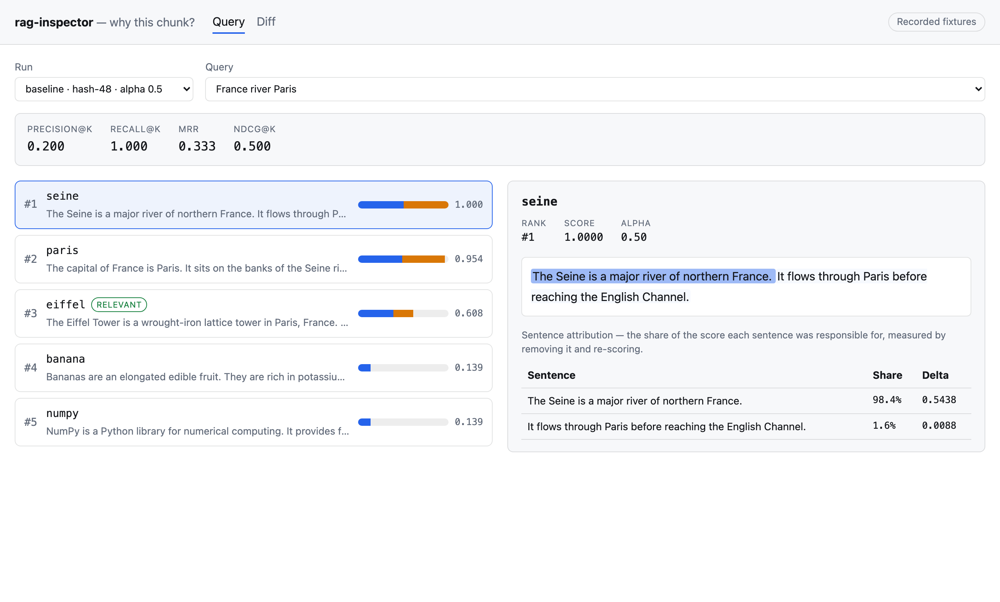
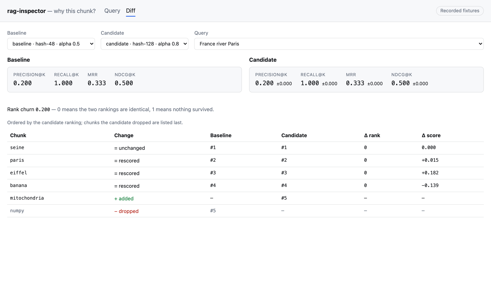

# rag-inspector

Retrieval explainer for RAG: **why did _this_ chunk end up in the model's
context**, and what changed when you swapped the retriever.

[](https://github.com/mykolapodpriatov/rag-inspector/actions/workflows/ci.yml)
[](https://mykolapodpriatov.github.io/rag-inspector/)
[](LICENSE)

**[Live demo →](https://mykolapodpriatov.github.io/rag-inspector/?query=France+river+Paris&chunk=seine)**
— runs on recorded fixtures, so it needs no backend and works offline.



## Why this project exists

RAG debugging is usually guesswork. The model answered badly; the retrieval
either was or was not the reason; nobody can tell which without reading raw
JSON.

Three questions come up every time, and this answers all three from the same
data:

1. **Why did this chunk win?** Not "it scored 0.85" — _which sentence_ earned
   the score, and whether the lexical or the dense side of a hybrid retriever
   decided it.
2. **Did retrieval actually fail, or did the model?** Precision@K, Recall@K, MRR
   and nDCG against declared ground truth, per query.
3. **What did the model bump change?** A git-style diff between two runs:
   added, dropped, moved, rescored.

The demo opens on a **real retrieval failure**. The query _"France river Paris"_
declares `eiffel` as its answer, and the retriever puts `seine` and `paris`
above it — precision `0.200`, MRR `0.333`. The sentence attribution shows why:
98.4% of `seine`'s score came from _"The Seine is a major river of northern
France."_ The fixtures were not curated to make retrieval look good.

## Architecture

```
  why-this-chunk ─┐
                  ├─ scripts/generate-fixtures.py ──▶ src/fixtures/runs.json
  retrieval-diff ─┘                                          │
                                                             ▼
                          ┌──────────────── RetrievalSource ────────────────┐
                          │  fixtureSource (default)   │   httpSource       │
                          └────────────────┬───────────┴────────────────────┘
                                           │  zod-validated at the boundary
                                           ▼
                        domain/  metrics · diff · rank churn   (pure, no React)
                                           │
                                           ▼
                        screens/  Query · Chunk detail · Diff
                                           │
                                     selection in the URL
```

| Layer                           | Knows about                  | Must not know about                |
| ------------------------------- | ---------------------------- | ---------------------------------- |
| `src/domain`                    | metrics, diff, ranking maths | React, fetch, where data came from |
| `src/data`                      | sources and their schemas    | screens                            |
| `src/screens`, `src/components` | the source interface         | which implementation is behind it  |

ESLint enforces the React-free domain. A boundary nobody enforces erodes on the
first busy afternoon.

## Key engineering decisions

### Why retrieval sources are adapter-based

One interface — `listRuns`, `getRun`, `getExplanation` — with two
implementations. `fixtureSource` reads recorded runs and powers the demo, the
tests and local development, offline. `httpSource` speaks to a live retriever
over three endpoints, with the same methods and the same types.

Without that seam the demo would need a Python process, the test suite would
need a Python process, and a team with their own index would have to fork. With
it, pointing this at a real retriever is one file and no screen changes.

The domain model mirrors the Python tools **field for field**, deliberately: if
the frontend invented its own vocabulary, the HTTP adapter would become a
translation, and translations drift.
[ADR 001](docs/decisions/001-adapter-based-sources.md).

### An unlabelled query shows `—`, never `0.00`

`0.000` means the retriever surfaced nothing relevant. `—` means nobody has said
what relevant would be. A dashboard showing `0.00` next to an unlabelled query
**will be believed**, and the reader will conclude the retriever failed.

The metric functions return `null`, and that null flows all the way to the
component — a single `?? 0` at any layer would undo it.
[ADR 002](docs/decisions/002-metrics-on-the-client.md).

### The score bar shows contributions, not modality scores

A dense score of `0.9` at `alpha 0.2` contributes `0.18`. Drawing `0.9` would
tell the reader the dense side dominated when it accounted for less than a
fifth. The bar shows `alpha·dense` and `(1−alpha)·lexical`, and carries the same
numbers in its accessible name.

### Rank deltas are negative when things improve

`rankDelta = candidate − base`, so a promotion is `−2`. That reads backwards for
a second; the alternative reads backwards forever, because rank is an axis where
lower is better and inverting the delta would make `+2` mean "better" in one
column and "worse" in the column beside it.
[ADR 003](docs/decisions/003-diff-model.md).

## The diff screen



Chunks are matched by id — what a retriever returns and what a CI gate asserts
on. Rows are ordered by the candidate ranking because that is what you are
evaluating; dropped chunks have no position in it and go last. Rank churn
charges a dropped chunk the maximum, because falling out of the list is the
worst thing that can happen to one.

## The fixtures are generated, not written

`scripts/generate-fixtures.py` produces them by running the real tools:

```bash
WHY_THIS_CHUNK_PATH=../why-this-chunk python scripts/generate-fixtures.py
```

Two hybrid configurations over one eight-chunk corpus, with declared ground
truth, producing genuine adds, drops and rank moves. Hand-written fixtures drift
from what the tools actually emit, and then the UI is correct about data that
does not exist — the worst kind of correct.

The generated file is validated with zod on load, **including the committed
one**, so a regeneration that changes shape fails at the boundary with the field
named rather than as a mystery `undefined` three components deep.

## Performance

- Metrics and the diff are `useMemo`'d on the query and run, so switching chunks
  does not recompute them.
- The result list renders the top-K a run captured — five to a few dozen rows.
  Virtualisation is [tracked as an issue](https://github.com/mykolapodpriatov/rag-inspector/issues),
  not built speculatively: it addresses DOM size, and nobody has yet measured a
  DOM large enough to need it.
- Bundle: ~444 kB raw, ~130 kB gzipped, dominated by the router and query
  client.

## Testing

84 unit and component tests plus 12 Playwright specs. `pnpm test` · `pnpm e2e`.

| Layer              | Covers                                                                                |
| ------------------ | ------------------------------------------------------------------------------------- |
| Domain (node)      | every metric against **hand-computed** values, the diff model, rank churn             |
| Components (jsdom) | rendering decisions, plus `axe-core` failing the build on serious/critical violations |
| E2E (Playwright)   | the production build, against the committed fixtures                                  |

The E2E specs assert **real dataset facts** — `France river Paris` giving
precision `0.200` and MRR `0.333` — so a regenerated fixture that changes
retrieval behaviour fails loudly rather than silently.

Every metric is checked against a value written out by hand in a comment.
Checking a metric against another implementation of the same formula proves only
that two things agree, including when both are wrong.

## Accessibility

- Metrics render `—` with a screen-reader explanation, never a misleading `0.00`.
- Relevance is marked with **text**, not only colour; the same is true of every
  change in the diff table, where an arrow is paired with a word.
- The score bar is `role="img"` with an accessible name carrying the numbers — a
  stacked bar means nothing to a screen reader.
- Selects use explicit `htmlFor`/`id`. A `<label>` wrapping a `<select>` puts the
  control's own value into its accessible name; the E2E suite caught the
  candidate field announcing itself as _"Candidate baseline · hash-48 · alpha
  0.5"_.
- `axe-core` runs over the components in the test suite and fails CI on serious
  or critical violations.

Dark mode follows `prefers-color-scheme`, with colours declared once as tokens.

## Running locally

```bash
pnpm install
pnpm dev      # http://localhost:5173, on the bundled fixtures
pnpm test     # 84 unit + component tests
pnpm e2e      # 12 Playwright specs against a production build
pnpm build
```

### Pointing it at a live retriever

Implement the three endpoints and swap the source:

```
GET /runs                                  -> RunSummary[]
GET /runs/:id                              -> RetrievalRun
GET /runs/:id/explanation?query=&chunkId=  -> Explanation | 404
```

```tsx
<SourceProvider source={createHttpSource({ baseUrl: '/api/retrieval' })}>
```

No screen changes — that is the point of the interface.

## Architecture decisions

- [ADR 001 — Retrieval sources are adapter-based](docs/decisions/001-adapter-based-sources.md)
- [ADR 002 — Metrics on the client, and null when undefined](docs/decisions/002-metrics-on-the-client.md)
- [ADR 003 — The diff model and its sign convention](docs/decisions/003-diff-model.md)

## Roadmap

Tracked as [open issues](https://github.com/mykolapodpriatov/rag-inspector/issues):

- content-based chunk matching, so a re-chunked index does not read as
  "everything removed, everything added"
- a reference FastAPI adapter for `httpSource`
- virtualisation, once a DOM large enough to need it exists
- the counterfactual "smallest config change that would have surfaced the right
  chunk" from `why-this-chunk`

## Related

- [why-this-chunk](https://github.com/mykolapodpriatov/why-this-chunk) — the
  retrieval explainer whose output this renders
- [retrieval-diff](https://github.com/mykolapodpriatov/retrieval-diff) — the
  snapshot/diff tool whose lockfile shape the run model mirrors

## License

MIT — see [LICENSE](LICENSE).
